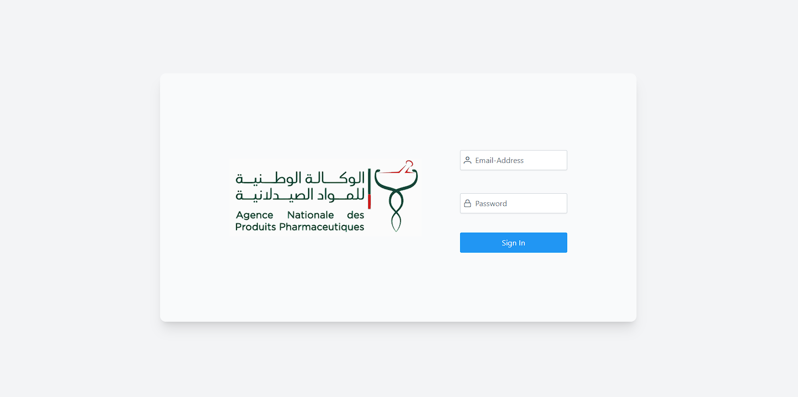
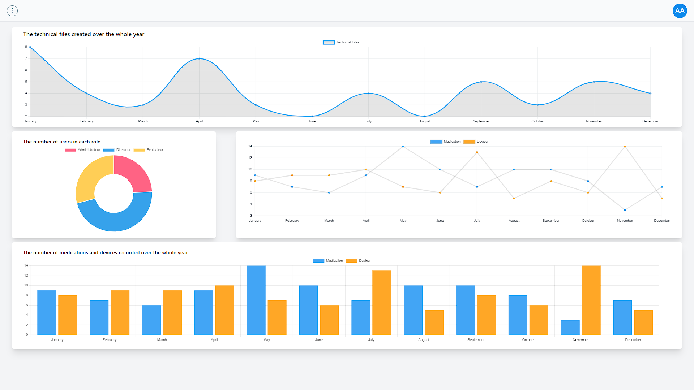
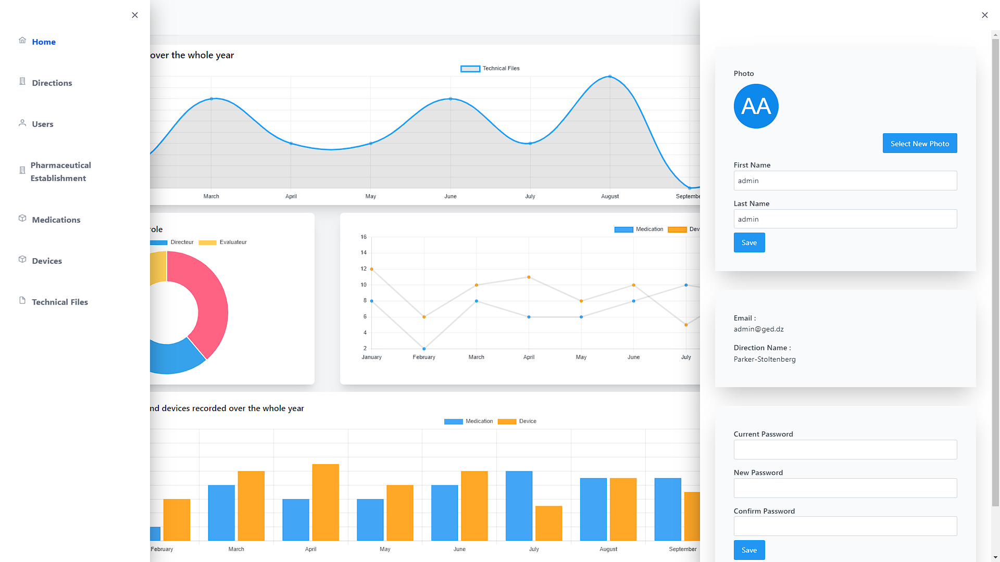
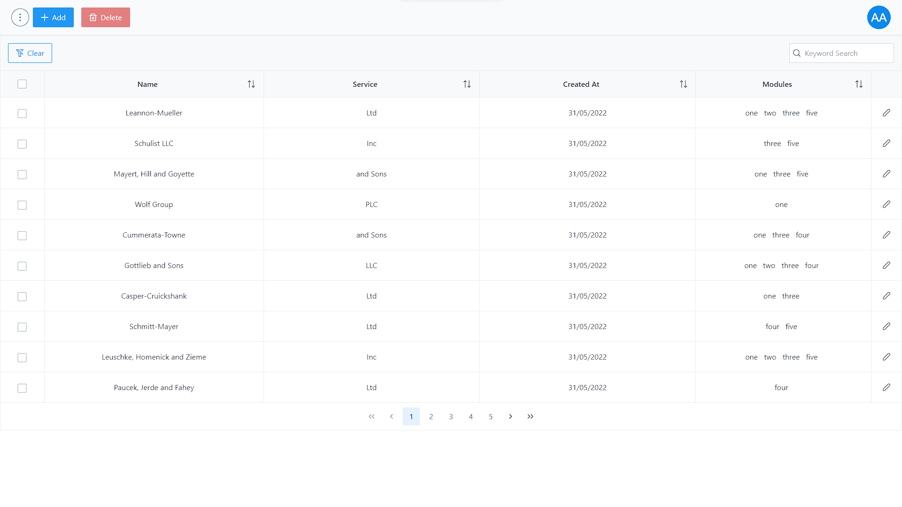
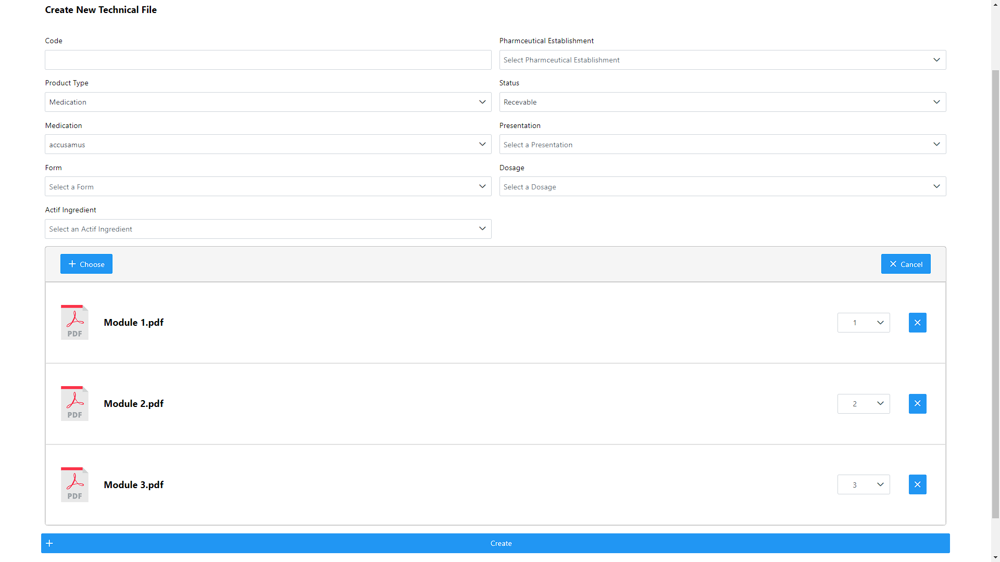
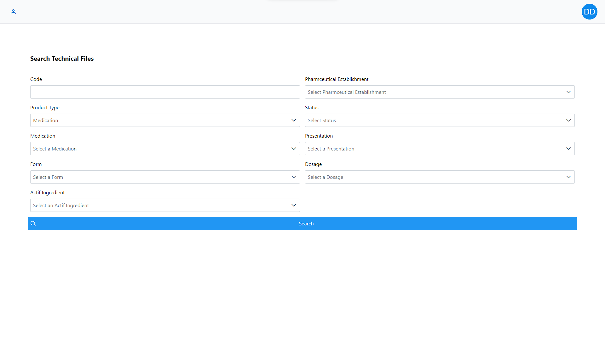
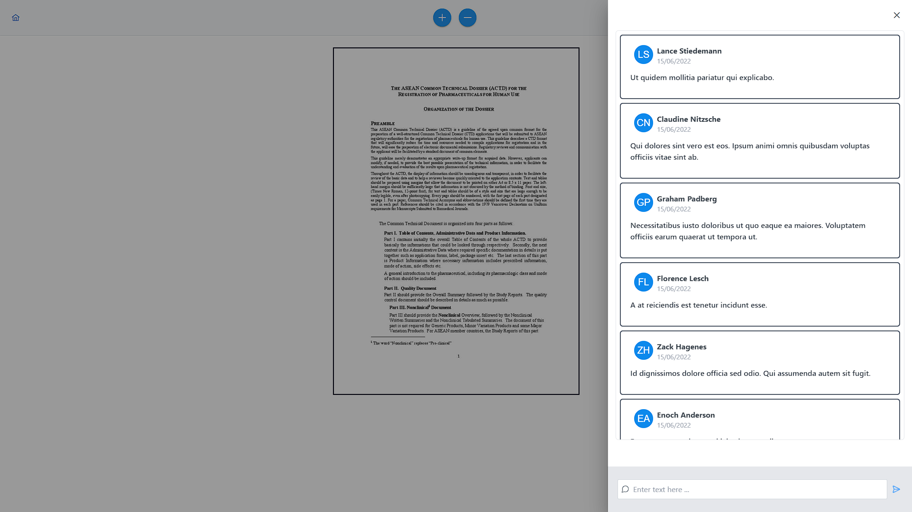

# GED ANPP - Electronic Document Management System

An advanced Electronic Document Management System (EDMS) developed using Laravel and Vue.js. The system provides comprehensive document management capabilities with role-based access control and real-time PDF annotation features.

## Features

### Document Management
- Create, index, classify, search, and delete files and documents
- Real-time PDF visualization and annotation
- Fast document access (< 5s loading time)
- Document sharing and access restriction management

### User Management
- Role-based access control with three user types:
  - **Administrator**: Full system control, user management, and statistics access
  - **Director**: Document validation and team management capabilities
  - **Evaluator**: Document review and commenting privileges
  ### Screenshots

  #### Login Page
  
  The authentication page where users can log in to access the system.

  #### Administrator Dashboard
  
  The main dashboard for administrators to view statistics and manage users and documents.

  #### User Profile
  
  A sidebar containing user information that can be modified.

  #### User Management
  
  Administrators can manage users, including viewing, adding, and deleting user data.

  #### Add CTD
  
  Administrators can add technical documents (CTD) with PDF files.

  #### Search CTD
  
  Directors and evaluators can search for technical documents using a form.

  #### Comment System
  
  Each document has a comment panel for users to leave comments.

### Pharmaceutical Data Management
- Pharmaceutical establishment management
- Medical product management
- Technical documentation handling
- DCIS management (substances and drug molecules)

### Dashboard & Analytics
- Dynamic dashboards for document metrics
- Statistical analysis tools
- Real-time collaboration features

## Technical Stack

### Backend
- **PHP/Laravel**: Server-side framework
- **MySQL**: Database management
- **Inertia**: Server-side SPA handling

### Frontend
- **Vue.js**: UI framework
- **JavaScript**: Client-side programming
- **Tailwind CSS**: Utility-first CSS framework
- **PrimeVue**: UI component library

## Installation

1. Clone the repository:
```bash
git clone https://github.com/Nabil-Bil/gedAnpp.git
```

2. Install PHP dependencies:
```bash
composer install
```

3. Install Node dependencies:
```bash
npm install
```

4. Configure environment:
```bash
cp .env.example .env
php artisan key:generate
```

5. Set up database credentials in `.env`

6. Create and seed the database:
```bash
php artisan migrate
php artisan db:seed
```

7. Start the development server:
```bash
php artisan serve
```

### Test Credentials

You can use the following test credentials to log in to the system:

- **Administrator**
  - Email: `admin@ged.dz`
  - Password: `admin@ged.dz`

- **Director**
  - Email: `directeur@ged.dz`
  - Password: `directeur@ged.dz`

- **Evaluator**
  - Email: `evaluateur@ged.dz`
  - Password: `evaluateur@ged.dz`

## System Requirements

- PHP >= 7.4
- Node.js
- MySQL
- Composer
- NPM

## Key Technical Specifications

- Web-based solution
- Evolutive architecture
- ANPP data architecture compatibility
- Secure data input handling
- Intuitive user interface
- Quick document loading (< 5s)

## Security Features

- Role-based access control
- Document access restrictions
- User authentication
- Input validation
- Secure file handling
